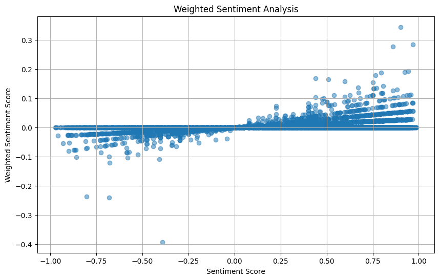
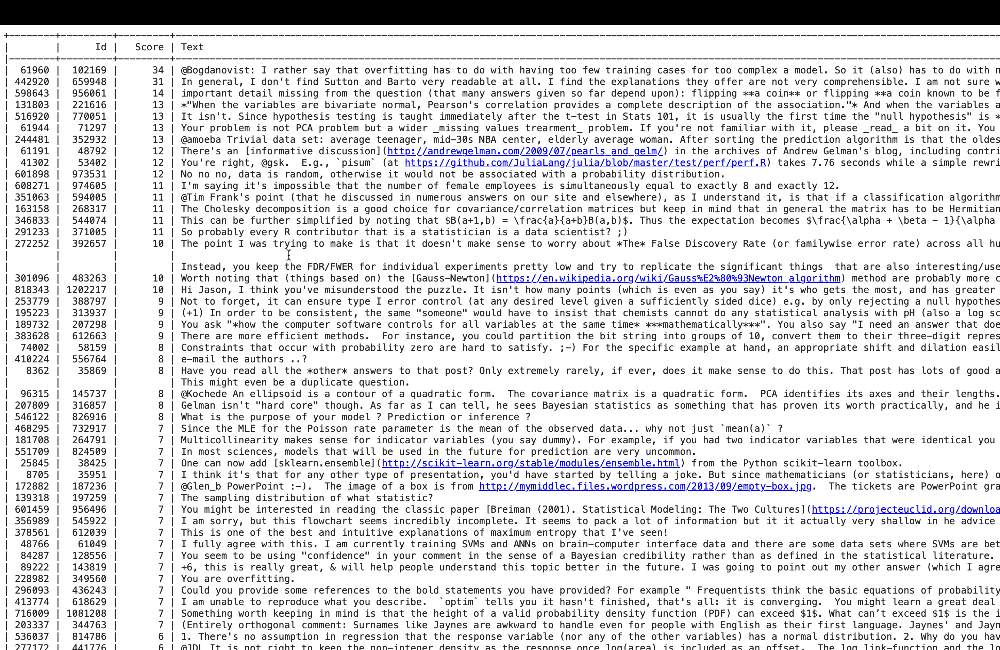
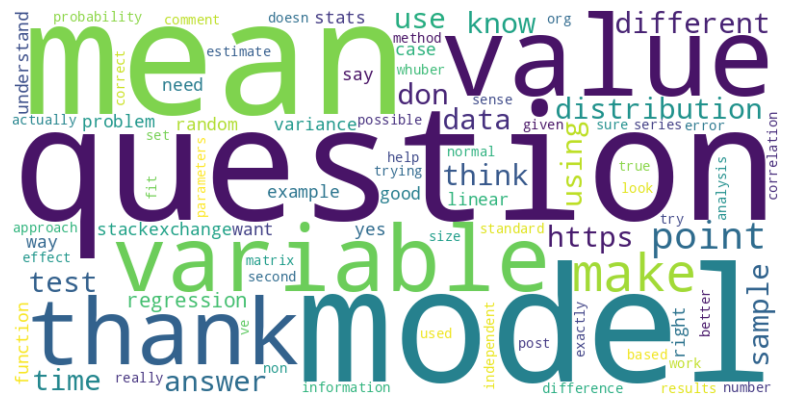
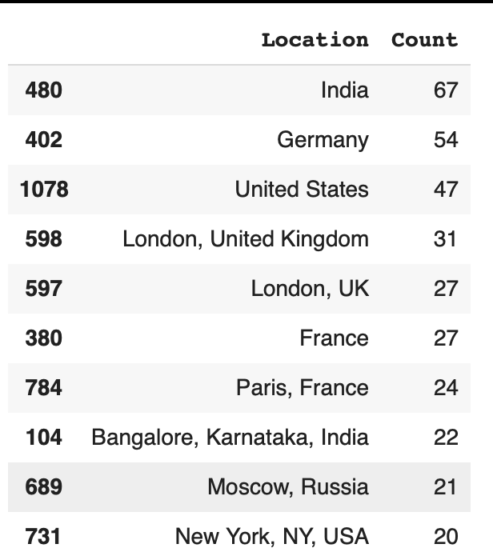
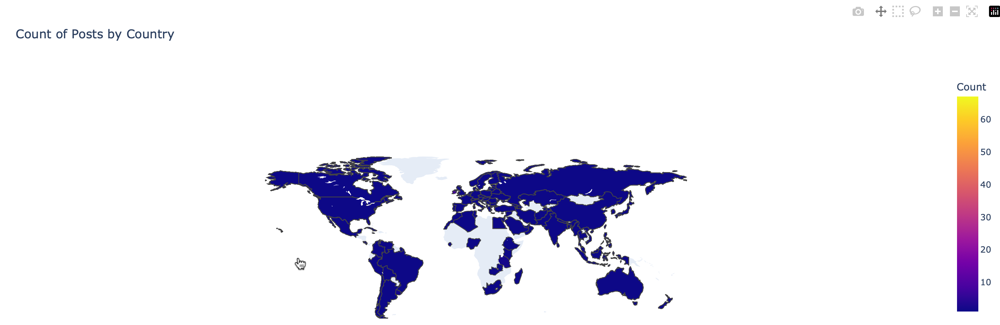

# Cross Validated - Stack Exchange text mining and sentiment analysis

## Language:
Python: numpy, pandas, NLP (SentimentIntensityAnalyzer)

## Overview:

I found text analysis particularly compelling due to its ability to render data in a more personal and nuanced manner. This personalization arises from how text data inherently captures individual sentiments, expressions, and linguistic nuances, offering profound insights into human behaviors and societal trends. I am also particularly interested in examining the sentiments and demographics of users on hot topics in large forums, which is why I target Cross Validated (math focus) on Stack Exchange.

**1. Starting off:**
- Choose any StackExchange site dealing with topics that you find interesting: https://stackexchange.com/sites?view=list#traffic.
- Download the site’s most recent datadump from: https://archive.org/details/stackexchange/
- Read the description of all the data tables published at: https://meta.stackexchange.com/questions/2677/.

**2. DataFrame construction:**

Since the download file will be in xml format, you can directly use Python's built in library, ElementTree, that has functions to read and manipulate XMLs. However, for me I more familar with normal interaction with csv and pandas so I used ElementTree to convert to csv and frame to dataframe.

I buid a function to convert XML data into a CSV format:

- Parsing XML by input_file using ET.parse, and it retrieves the root of the XML tree.
```
def xml_to_csv(input_file, output_file):
    tree = ET.parse(input_file)
    root = tree.getroot()
    all_keys = set()
```
- Extracting Headers: iterates over all elements tagged as <row> under the root, collecting all unique attribute names from these elements. These names are used as column headers in the resulting CSV file.
```
for element in root.findall('.//row'):
      all_keys.update(element.attrib.keys())

    header = list(all_keys)
```
- Writing to CSV: opens a new CSV file specified by output_file for writing. It first writes the headers. Then, for each <row> element found in the XML, it creates a list where each entry corresponds to the value of the XML attribute for each header (column). If an attribute is missing from an element, it fills that position with an empty string. This list forms a row in the CSV file, which is then written to the file.
```
with open(output_file, 'w',newline='', encoding='utf-8') as csv_file:
      writer = csv.writer(csv_file)
      writer.writerow(header)
      for element in root.findall('.//row'):
        row = [element.attrib.get(key,'') for key in header]
        writer.writerow(row)
```
- Finaly, call the function for multiple files processing.

**3. Weighted Sentiment Plot**

Uses SentimentIntensityAnalyzer from VADER to compute the compound sentiment score (number of upvote) of the comment text. The compound score ranges from -1 (very negative) to 1 (very positive).



The community appears to respond more favorably to positive comments, as indicated by the higher weighted scores in the positive sentiment zone. This might reflect a community bias towards positivity, or it could indicate that positive content is more engaging or valuable to the community.

**4. Content that gets the most scores**

From the plot, I was curious what type of comment that get most upvote or trigger high engagement to be precise. By listing top 50 comments which is determined by finding the 95th percentile of the 'Score' column in the comments DataFrame, I get the below tabular form



Surprisingly, the topics that are driving the most attention are not pure math or theories but those related to advanced data analysis, statistical modeling, and machine learning. These topics are summarized as follows:

- Statistical Methods and Testing:

Discussions on overfitting, hypothesis testing, and statistical significance. These are often debated in terms of methodology and interpretation.

- Data Analysis Techniques:

References to bivariate normal distributions and the use of different statistical tests and data analysis strategies. These comments discussing practical applications and theoretical considerations.

- Machine Learning Models:

Mention of specific models and algorithms such as PCA (Principal Component Analysis) and SVMs (Support Vector Machines). These are common in discussions related to data science and machine learning.

- Methodological Debate:

Some comments delve into deeper methodological debates about the right approaches to data analysis, model fitting, and the interpretation of results.

**5. Keyword and Phrase Analysis**

To easy identify topic, we can extract most frequent keywords and phrases from these comments. This can help identify what topics or language are most appealing to the community

I implemented sklearn's CountVectorizer, instantiated with English stop words removed and a maximum of 100 features. This tool converts text data into a matrix of token counts. The vectorizer fits to the text data from the comments['Text'] column and transforms it into a sparse matrix X where each row corresponds to a document and each column represents one of the top 100 words.



From this visualization, excluding the words 'Queries' and 'Answers,' we can observe that the most common topic that engages users is basic statistical concepts, as evidenced through words like 'mean,' 'value,' 'regression,' etc. It aligns with the most upvoted topics in the comment section.

**6. Located in which country that has the most active users**

The demographics of users can reveal a lot of information, such as which countries are most engaged in such a forum, and identify the predominant careers or fields of study in those countries. These datadump on Stack Exchange already have the user profile data, just do some basic user counts and sort and we got this results:



We can see top 3 active user group come from India, Germany and US.

Also can build geomap to identify which country haven't access to this forum. 



From the map, we can see almost user in every country engage with this math forum (Cross Validated), there is a few countries with little or no population such as Greenland, Africa continent and Papua New Guinea
